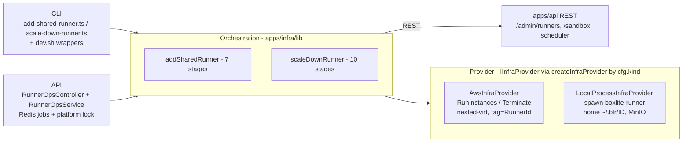
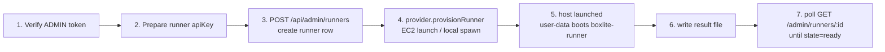
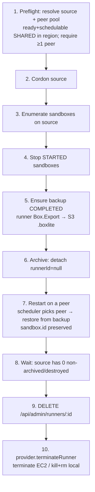
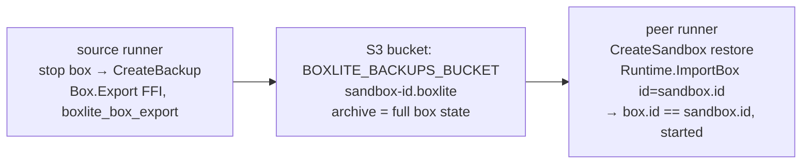
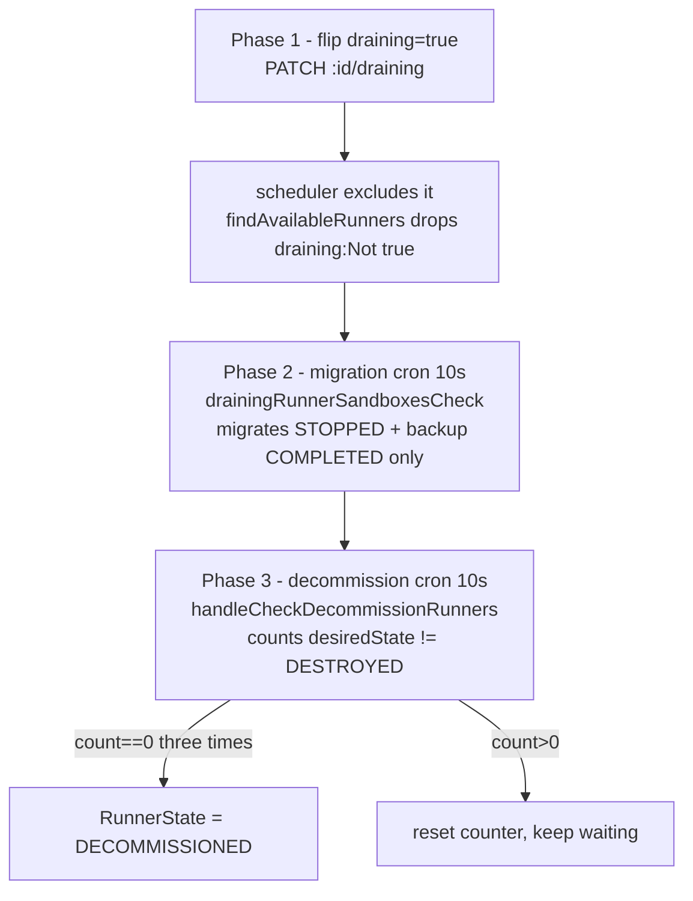

# Runner Scaling — Design (as implemented)

Concise design of the runner add / scale-down implementation in this branch.
For the operator runbook see [runner-ops-api-runbook.md](./runner-ops-api-runbook.md);
for live E2E results see the `*-e2e-*.md` files.

## 1. Goal & scope

Add capacity to (and remove capacity from) a SHARED region without losing the
sandboxes running on a removed host. Constraints:

- **Manual / explicit triggers** — no autoscaler decision-making (yet).
- **SHARED-region, in-region migration only** — boxes move between SHARED
  runners in the same region.
- **No SQL surgery** — everything flows through the `apps/api` REST surface.
- **One abstraction over dev and prod** — the same orchestration drives a local
  process (dev, macOS) and real EC2 (prod).

## 2. Design principles

| Principle | What it means in code |
|---|---|
| **Provider abstraction** | "create/destroy a runner host" hides behind `IInfraProvider`; orchestration never touches EC2/process APIs directly. |
| **In-process backup** | The runner exports/imports a box via `libboxlite.a` FFI (`Box.Export`/`Runtime.ImportBox`) → S3; no `boxlite serve` sidecar (it needed an exclusive `BOXLITE_HOME` lock). |
| **Identity-preserving migration** | Restore passes `id = sandbox.id` so `box.id == sandbox.id` survives a move. |
| **Placement via cordon** | There is no per-box `runnerId` pin; the scheduler picks randomly among ready+schedulable runners in-region, so callers **cordon all but the target**. |
| **Per-environment config** | Backups bucket / region / subnet / instance-profile are resolved once at provider construction — never threaded per call. |
| **Idempotent, resumable stages** | Each flow is a staged async generator; the API path adds a Redis job store + a platform-wide lock (one add + one scale-down at a time). |

## 3. Architecture

- `IInfraProvider` ([types.ts](../../apps/infra/lib/infra-provider/types.ts)):
  `provisionRunner(spec) → {endpoint}`, `terminateRunner(id)`, `describeRunner(id) → {alive}`.
- `AwsInfraProvider` ([aws.ts](../../apps/infra/lib/infra-provider/aws.ts)): EC2
  `RunInstances` (Ubuntu Noble x86_64 AMI, `CpuOptions.NestedVirtualization=enabled`,
  tags `RunnerId`/`BoxliteOwner`/`BoxliteRegion`, IAM instance profile, public
  subnet); terminate/describe by `tag:RunnerId`. Backups bucket from config.
- `LocalProcessInfraProvider` ([local.ts](../../apps/infra/lib/infra-provider/local.ts)):
  detached `spawn(boxlite-runner)` with `BOXLITE_HOME_DIR=~/.blr/<12-char-id>`
  (short root for macOS `SUN_LEN`), writes `meta.json {runnerId,pid,port}`;
  terminate = SIGTERM→SIGKILL + remove home; describe = pid alive.

## 4. Workflow — add a SHARED runner

The runner boots from user-data (downloads the `boxlite-runner` release, installs
a systemd unit with `BOXLITE_API_URL`, `BOXLITE_BACKUPS_BUCKET`, …) and heartbeats
to the API until it reaches `ready`.

## 5. Workflow — scale-down (with live box migration)

To guarantee migration lands on a chosen peer (and never an unrelated runner such
as a shared `default`), cordon every in-region runner except the intended target
for the duration, then restore. The `#3` no-peer guard aborts a scale-down that
has nowhere to migrate.

## 6. Box migration data flow

Backup needs both `BOXLITE_BACKUPS_BUCKET` set on the runner **and** a
backup-capable runner binary (the FFI export). Bucket must match the runner IAM
S3 policy (`arn:aws:s3:::boxlite-volume-*`); dev uses `boxlite-volume-backups-dev`.

**Latest-only backup (MVP scope).** The S3 key is `<sandbox-id>.boxlite` with no
timestamp, so each backup overwrites the prior one — exactly one archive per
sandbox. apps/api still mints timestamped refs (`backup-<id>:<ts>`) and keeps an
`existingBackupSnapshots` history with a "fall back to an older backup" loop, but
on BoxLite runners that loop is a no-op: every historical ref resolves to the
same object, so a restore always returns the latest archive. This is correct for
the only paths today (start-after-stop and scale-down migration both want the
latest) but provides **no point-in-time restore and no corrupt-latest fallback**.
Adding either requires a timestamped key + a retention/cleanup policy + aligning
apps/api's ref selection — deferred until a real PITR requirement exists.

## 7. Providers & config

| | AWS (`AwsInfraProvider`) | Local (`LocalProcessInfraProvider`) |
|---|---|---|
| host | EC2 (nested-virt instance, e.g. `c8i.large`+) | native `boxlite-runner` process |
| backups bucket | real S3 (`boxlite-volume-backups-${stage}`) | MinIO bucket |
| config source | env / SST stage convention | `BOXLITE_RUNNER_OPS_LOCAL_*` env |
| terminate | `TerminateInstances` by tag | SIGTERM→SIGKILL + rm `~/.blr/<id>` |

Both consume one config object (`AwsProviderConfig` / `LocalProviderConfig`);
`createInfraProvider(cfg)` selects by `cfg.kind`. `BOXLITE_BACKUPS_BUCKET` is set
on every runner at launch (backup is always-on; no per-runner toggle).

## 8. Status & known constraints

- ✅ Validated: local add/scale-down/migration; AWS provision/terminate +
  empty-runner scale-down; **real-AWS live box migration with identity
  preservation** (2026-05-28, integration HEAD, backup-capable runner —
  [E2E](./aws-migration-e2e-2026-05-28.md)). Per-env backups-bucket config
  confirmed on freshly provisioned runners. Unit suites green.
- ⚠️ Migrating onto a peer that hosts live boxes can flip those bystanders to
  `error` via the API's `sync-states` re-create race
  ([follow-up](../follow-ups/runner-migration-bystander-recreate-race.md)).
- ⚠️ **Released runner lacks the backup binary** → the only blocker for hands-off
  AWS box-migration; build/release a backup-capable runner ([follow-up](../follow-ups/runner-backup-not-in-released-runner.md)).
- ⚠️ Scheduler is random in-region (no per-box pin) → cordon-all-but-target to
  steer placement.
- ⚠️ `sdks/go ListInfo` CGO crash on v0.9.5 (intermittent; prod v0.8.2 unaffected;
  [follow-up](../follow-ups/runner-listinfo-cgo-crash.md)).
- The deployed dev API predates `RunnerOpsController`; the **CLI scripts** (which
  call `/admin/runners` + `/sandbox` directly) are the validated path there.

## 9. Comparison with Daytona's native design

BoxLite forks Daytona. Three places where our runner-scaling deliberately
extends or diverges from Daytona's native behavior:

### 9.1 Add runner — we provision the host; Daytona only registers it

Daytona's add-runner is **just a DB row**: `POST /runners` (`createRunner`,
[runner.controller.ts:78](../../apps/api/src/sandbox/controllers/runner.controller.ts#L78))
inserts a `runner` record; the host itself is provisioned out-of-band and the
runner flips to `READY` by hitting `POST /runners/healthcheck`. Daytona has **no
ability to create an EC2**.

Our `addSharedRunner` keeps that exact contract but wraps host provisioning
around it via `IInfraProvider`: mint the **DB row first** (`POST /admin/runners`,
to obtain the runner id + token), **then** `provisionRunner` launches the EC2
with that token baked into user-data, and the booted runner heartbeats to
`READY` just like Daytona. So we are a superset: same registration mechanism,
plus automated host lifecycle.

### 9.2 Scale-down / drain — we stop live boxes; Daytona waits for them

Daytona's `draining-runner-sandboxes-check` cron migrates **only boxes that are
already stopped and backed up** — its query filters
`state=STOPPED, desiredState=STOPPED, backupState=COMPLETED, backupSnapshot NOT NULL`
([sandbox.manager.ts:331](../../apps/api/src/sandbox/managers/sandbox.manager.ts#L331)).
A `STARTED` box is never touched, so a runner with live boxes stays `draining`
indefinitely until **something external stops them**.

Our `scaleDownRunner` is **active**: stage 4 stops the `STARTED` boxes itself,
then backs up → archives → restarts on a peer (§5). This makes scale-down
hands-off (no external actor needed) but **may interrupt a user's running
workload** — the deliberate trade-off for "remove this host now." A future
policy could gate the stop (drain-and-wait vs. stop-now) per request.

### 9.3 Backup transport — we use S3; Daytona pushes to a registry

The `apps/api` orchestration is still Daytona's **registry** model: a backup is
an OCI image ref `…/backup-<sandbox.id>:<ts>`
([backup.manager.ts:406](../../apps/api/src/sandbox/managers/backup.manager.ts#L406)),
created via `DockerRegistryService` and restored by `pullSnapshotRunner`
([snapshot.manager.ts:514](../../apps/api/src/sandbox/managers/snapshot.manager.ts#L514)) —
i.e. commit → push → pull → run, exactly like draining a container host.

BoxLite **diverges at the runner**: a box is a libkrun microVM, not a container,
so it can't `docker commit`/push. `BuildSnapshot` and `PushImage` are therefore
**stubs** ([stubs.go:384](../../apps/runner/pkg/boxlite/stubs.go#L384),
[:419](../../apps/runner/pkg/boxlite/stubs.go#L419)), and `CreateBackup` was
reimplemented as `Box.Export → .boxlite → S3` ([stubs.go:138](../../apps/runner/pkg/boxlite/stubs.go#L138)).
The registry-style `backup-<id>` ref is kept only as a naming token that
`isBackupRef` recognizes and reroutes to S3 ([stubs.go:249](../../apps/runner/pkg/boxlite/stubs.go#L249)).

**Could we go back to Daytona's registry push/pull, dropping S3 and the
backup-capable-runner prerequisite?**

- **(a) Replace direct S3 with registry push/pull — feasible and cleaner.** The
  API is already built for it (`pullSnapshotRunner` exists); restore would become
  an ordinary snapshot pull, removing the `isBackupRef` special case and the
  runner's `BOXLITE_BACKUPS_BUCKET` / S3-IAM config. Caveat: the registry
  (SnapshotManager) is **itself backed by S3**, so this removes the runner's
  *direct* S3 coupling (it uses registry creds instead), not S3 as the substrate.
- **(b) It does NOT remove the backup-capable-runner prerequisite — it relocates
  it.** Today the prerequisite is "runner has `Box.Export` (`boxlite_box_export`
  FFI)". Under the registry model it becomes "runner can commit a box's rootfs to
  an OCI image + `PushImage`" — and both are currently **stubs**, unimplemented in
  the released `v0.9.5` runner just as `Box.Export` was. Either way you must
  implement and re-release a capable runner. Converting a libkrun ext4 rootfs into
  bootable OCI layers is arguably **harder** than the straight VM-state
  export/import we already have.
- **Semantic limit:** an OCI/registry backup captures only the **filesystem**
  (like `docker commit`), not live memory/process state. Our migration stops the
  box first (§5), so it is disk-only (cold) anyway — compatible today, but the
  registry route forecloses any future warm/live migration that a full
  `.boxlite` state export could enable.

**Bottom line:** registry-based backup is the cleaner long-term architecture
(unifies with the snapshot-pull path, drops runner S3 config, fully aligns with
Daytona's native drain), but it is **not** a shortcut around needing a
backup-capable runner. To unblock hands-off AWS migration *now*, the cheapest
path is still to re-cut a runner release carrying the existing `Box.Export → S3`
implementation ([follow-up](../follow-ups/runner-backup-not-in-released-runner.md)).

## 10. What makes a runner "backup-capable" (the change layers)

A runner binary supports backup/restore **iff all of these layers are present** —
the released `v0.9.5` predates layers ② and ④, so it ships stubs. Bottom → top:

| Layer | Commit | Files | What it adds |
|---|---|---|---|
| ① Rust core | (pre-existing) | [`litebox/mod.rs:171`](../../src/boxlite/src/litebox/mod.rs#L171) `export` → [`clone_export.rs:174`](../../src/boxlite/src/litebox/clone_export.rs#L174); [`runtime/core.rs:329`](../../src/boxlite/src/runtime/core.rs#L329) / [`import.rs:24`](../../src/boxlite/src/runtime/import.rs#L24) `import_box` | the real box export/import logic in the core crate |
| ② C SDK FFI | `8fe520b8` | [`sdks/c/src/box_handle.rs:380`](../../sdks/c/src/box_handle.rs#L380) `boxlite_box_export`; [`sdks/c/src/runtime.rs:691`](../../sdks/c/src/runtime.rs#L691) `boxlite_runtime_import_box`; `sdks/c/include/boxlite.h` | exposes ① as C-ABI symbols → a `libboxlite.a` that **exports `boxlite_box_export`** (the symbol v0.9.5's lib lacks; verified by `nm`) |
| ③ Go SDK | `8fe520b8` | [`sdks/go/box_archive.go:36`](../../sdks/go/box_archive.go#L36) `Box.Export`; [`:60`](../../sdks/go/box_archive.go#L60) `Runtime.ImportBox` | cgo bindings over ② |
| ④ Runner Go | `9528cf5e` (+ reorder `58a40623`) | [`apps/runner/pkg/boxlite/stubs.go`](../../apps/runner/pkg/boxlite/stubs.go): `CreateBackup` ([:138](../../apps/runner/pkg/boxlite/stubs.go#L138)), `createFromBackupArchive` ([:253](../../apps/runner/pkg/boxlite/stubs.go#L253)), `isBackupRef` ([:249](../../apps/runner/pkg/boxlite/stubs.go#L249)), `backupS3Client` ([:204](../../apps/runner/pkg/boxlite/stubs.go#L204)); `client.go`, `registry.go`, `api/controllers/sandbox.go` | replaces the "not yet implemented" stub: `box.Export()` → `.boxlite` → S3 upload; restore = download → `ImportBox(name=id, id=id)` (preserves `sandbox.id == box.id`); `58a40623` decouples Stop from CreateBackup so scale-down can do stop→backup |
| ⑤ Build wiring | `9ae01512` | [`apps/runner/go.mod`](../../apps/runner/go.mod) `replace …/sdks/go => ../../sdks/go` | links the **in-tree** Go SDK (③), not a published version |

Runtime prerequisites (config, not the binary): `BOXLITE_BACKUPS_BUCKET` set on
the runner (written by `add-shared-runner-dev.sh` per-env config) **and** the
runner IAM role's S3 policy covering that bucket (`arn:aws:s3:::boxlite-volume-*`).

**In short:** a binary is backup-capable iff it links a `libboxlite.a` carrying
the ② FFI symbols **and** the ③ Go SDK (via the ⑤ replace) **and** contains the
④ real `CreateBackup`. The released `v0.9.5` was compiled before ②/④ landed, so
it is a stub — re-cutting it (Build C SDK → Build Runner from current source) is
the [re-cut-release fix](../follow-ups/runner-backup-not-in-released-runner.md).

## 11. Adopting Daytona's native `draining` pipeline (alternative to §5)

§5's `scaleDownRunner` is **bespoke active orchestration**: it cordons the source
by setting `unschedulable=true`
([scale-down-runner-lib.ts:116](../../apps/infra/lib/scale-down-runner-lib.ts#L116)),
then explicitly stops → backs up → archives → restarts → deletes → terminates. It
never sets the native `draining` flag, so Daytona's two drain crons stay
**dormant** in our scale-down today. This branch (`cloud-mvp-runner-drain`)
evaluates the opposite: flip the native flag and let Daytona's pipeline do the
work. This section records how that pipeline works, where it stalls, and what
adopting it would cost.

### 11.1 The native pipeline — three cron-driven phases

`draining` is a boolean on the runner
([runner.entity.ts:167](../../apps/api/src/sandbox/entities/runner.entity.ts#L167)),
**orthogonal** to `RunnerState` and to the `unschedulable` cordon flag §5 uses.
A drain is triggered by `PATCH /runners/:id/draining`
([runner.controller.ts:287](../../apps/api/src/sandbox/controllers/runner.controller.ts#L287)) —
which only flips the boolean. Everything else is cron-driven:

| Phase | Mechanism | Code |
|---|---|---|
| 1. Exclude from placement | `findAvailableRunners` filters out `draining:Not(true)` runners | [runner.service.ts:303](../../apps/api/src/sandbox/services/runner.service.ts#L303) |
| 2. Cold-migrate eligible boxes | `drainingRunnerSandboxesCheck` (10s, 10 runners/page) migrates only `STOPPED + desiredState=STOPPED + backupState=COMPLETED + backupSnapshot` via `reassignSandbox` → a random in-region peer (`excludedRunnerIds=[source]`) | [sandbox.manager.ts:303](../../apps/api/src/sandbox/managers/sandbox.manager.ts#L303), filter at [:331](../../apps/api/src/sandbox/managers/sandbox.manager.ts#L331) |
| 3. Decommission when empty | `handleCheckDecommissionRunners` (10s) counts boxes with `desiredState != DESTROYED`; **3 consecutive zero-counts → `RunnerState.DECOMMISSIONED`** | [runner.service.ts:678](../../apps/api/src/sandbox/services/runner.service.ts#L678) |

A box leaves the source's count by being migrated (its `runnerId` changes) or
archived (archive sets `runnerId=null`). On a **dedicated** runner this converges
on its own: the single tenant's boxes idle out via autostop / auto-archive and the
counter eventually hits zero.

### 11.2 Why it stalls on a shared runner

Phase 2 never touches a `STARTED` box (cross-ref §9.2). A shared runner hosts many
tenants; any one tenant with an active session or `autoStopInterval=0` keeps a box
`STARTED` indefinitely → the Phase-3 counter never reaches zero → the runner
**stays `draining` forever and never decommissions**. This non-convergence is
exactly why §5 stops live boxes itself instead of flipping `draining`.

### 11.3 Runner-side capability for the native path

Native migration is cold (backup → restore) — the same primitives as §6, gated by
the same backup-capable layering as §10. On a backup-capable integration runner
they are all present:

| Native-path op | Used for | BoxLite status (backup-capable runner) |
|---|---|---|
| scheduling exclusion + decommission counter | phases 1 & 3 | ✅ control-plane only, no runner dependency |
| `createBackup` | make a STOPPED box migratable | ✅ `Box.Export → .boxlite → S3` ([stubs.go:138](../../apps/runner/pkg/boxlite/stubs.go#L138)) |
| `createSandbox(skipStart)` with a `backup-<id>` ref | restore on the peer | ✅ `Create` reroutes backup refs to `createFromBackupArchive` ([client.go:160](../../apps/runner/pkg/boxlite/client.go#L160)) |
| `destroySandbox` / `sandboxInfo` | cleanup, backup/state polling | ✅ real |
| force-stop a `STARTED` box | shared-runner convergence | ⚠️ not in the native cron — must be added (§11.4) |

So the runner can already back up and restore for the native cron — **but only on
a backup-capable build** (§10). `main` / the released `v0.9.5` runner still ships
the old `CreateBackup` stub (`ErrNotImplemented`), so there the migration cron
finds zero eligible boxes and drain never progresses — the same blocker as §8 and
its [follow-up](../follow-ups/runner-backup-not-in-released-runner.md).

### 11.4 What adopting the native pipeline would still require

1. **A force-stop step for `STARTED` boxes** (else no convergence, §11.2). The
   native cron won't add it; you'd either pre-stop the boxes (what §5 stage 4
   already does) or extend the drain crons to stop `STARTED` boxes on `draining`
   runners. This is the deliberate "interrupt now vs. wait for idle" policy noted
   in §9.2.
2. **Host termination after `DECOMMISSIONED`.** The native pipeline only flips
   `RunnerState`; it does **not** terminate the EC2 / kill the local process. You'd
   still need `provider.terminateRunner` (§5 stages 9–10) triggered off the
   `DECOMMISSIONED` transition.
3. **Accept random in-region placement.** `reassignSandbox` uses
   `getRandomAvailableRunner` (no per-box pin), so you lose §5's
   cordon-all-but-target steering — fine for a fungible SHARED pool, but boxes can
   land on a peer that is itself busy (the bystander re-create race, §8).

**Bottom line:** on a backup-capable integration runner the native `draining`
pipeline is *capability-complete for cold migration*, but it is **not** a drop-in
scale-down — it still needs an added force-stop step and an external
host-terminate trigger, and it inherits random placement. §5's active
orchestration exists precisely because it bundles those three concerns into one
explicit, resumable flow. The native pipeline becomes the lighter-touch option
if/when (a) the backup-capable runner is the default build (§10) and (b)
interrupting live tenants on drain is an accepted policy.
